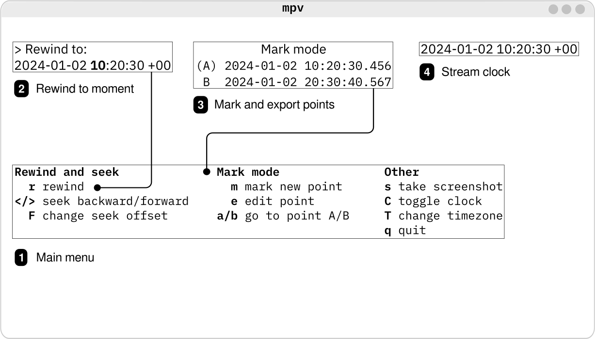

# mpv-ytpb

*mpv-ytpb* is an mpv user script to play and rewind YouTube live streams
interactively. The script detects `ytpb://<STREAM>` links passed to the mpv
player, and launches the *[ytpb](https://github.com/xymaxim/ytpb)* instance to
communicate with it via JSON IPC. A set of script key bindings allows to play,
mark, and export past moments of live streams.

## Install

*mpv-ytpb* requires *[ytpb](https://github.com/xymaxim/ytpb)* to be
installed in your `PATH`. Also, playing needs a custom mpv build with patched
FFmpeg (see xymaxim/ytpb#4 for details).

To install this script, copy `ytpb.lua` to your mpv `~~/scripts`
[directory](https://mpv.io/manual/master/#files).

## Usage 

    $ mpv ytpb://<STREAM>,

where `<STREAM>` is an YouTube video URL or ID.

It will open a player with a stream playing and bind `Ctrl+p` key to activate
the script main menu.

### Rewinding

Rewinding to a moment in a stream is bound to `r` key.

### Seeking

#### Nearby seeking

If ``cache=yes`` is set in ``mpv.conf`` (highly recommended), seeking works
smoothly within cached ranges as well as the mpv's A-B loop functionality with
the default keys.

#### Seeking by rewinding

Seeking backward and forward outside of cached ranges is possible with `<` and
`>` keys. The seeking by rewinding is a quick form of rewinding, with no need to
enter a target date. An user-defined, arbitrary offset is used instead. The
offset value can be changed with `F` key or via options.

The format of the input offset value (after `F` pressed) is
`[<days>d][<hours>h][<minutes>m][<seconds>s]`, where each part is optional, but
order must be preserved. For example, `1h`, `1h30m`, or `120m`.

### Mark mode

Mark mode can be enabled by marking a point with `m` key. Points are labeled A
and B. Marking works in a cycle manner. The current point can be edited by
changing a position (after seeking or rewinding) with `e` key. After points
selected, you can jump back to them with `a` and `b` keys.

## Key bindings

By default, there is only one key available—it toggles the script main menu:

`Ctrl-p` — activate and deactivate the main menu

After activation, the following key bindings are dynamically added:

### Rewind and seek

* `r` — rewind to a date
* `</>` — seek back and forward to an relative offset
* `F` — change seek offset

### Mark mode

* `m` — mark a new point labeled A or B
* `e` — edit current point
* `a/b` — go to point A or B

### Other

* `s` — take a screenshot and save to a file
* `C` — toggle clock
* `T` — change global timezone
* `q` — quit

## How it works

### First seconds

The script detects an YouTube video URL and checks a broadcast live status. If
live, it asks *ytpb* to compose a dynamic MPEG-DASH MPD starting from the
current moment, i.e. from the latest available media segment, and loads the file
to play.

### Rewinding and seeking

Rewinding and seeking actions are associated with sending the `yp:rewind` script
message to *ytpb* and listening back to a `yp:rewind-completed` message to run a
complete callback. At the same time, *ytpb* composes a new MPEG-DASH MPD
starting with a target media segment and execute the `loadfile` command. The
paused first segment is appeared on a screen, and the script runs the complete
callback to seek to a start position and update shown text overlays. It would be
nice to avoid that short quirk and seek straight to the start position in the
future.

## Known limitations

The clock showing the date and time is not guaranteed to display the actual
time. Going into details, we rely on the `Ingestion-Walltime-Us` metadata values
of the DASH media segments. While the streaming latency can be specified, there
is another issue, more significant. In fact, the clock shows a current playing
offset relative to the DASH MPD start time (the `Ingestion-Walltime-Us` value of
the first media segment). If playing part of a live stream has a gap, the
playing timeline does not update according to new perturbed timestamps after a
gap. A workaround solution would be to add a key to create and load a new
manifest at the current time and continue playing.

## Acknowledgements

The script uses the
[python-mpv-jsonipc](https://github.com/iwalton3/python-mpv-jsonipc) package to
communicate with *ytpb* via JSON-IPC.

The date and time picker was inspired by the
[seek-to.lua](https://github.com/occivink/mpv-scripts/tree/master?tab=readme-ov-file#seek-tolua)
script script.
